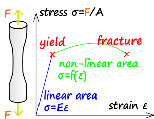
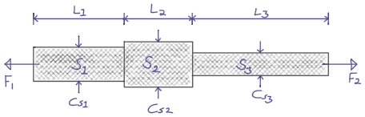

= Solid Mechanics: Theory and Examples   
Dr. Sam Macharia <https://orcid.org/0000-0002-7326-7502>; Home <https://SiliconWit.com>
:description: Engineering, Computing, Science, and Philosophy 
:keywords: Mechanics of Solids, Mechanics of Materials, Strength of Materials, 
:docinfo1: 
:nofooter:
:title-page-background-image: 
:doctype: book
:backend: docbook
:toc: left 
:icons: font 
:favicon: favicon.png
:stem: asciimath
:figure-caption: Figure
:figure-number: 
:source-highlighter: rouge // not used 
:source-highlighter: highlight.js
:stem: latexmath 
:numbered:
:eqnums: all
:imagesdir: solid-mechanics-figs
:experimental:
// asciidoctor -r asciidoctor-mathematical -a mathematical-format=svg solid-mechanics.adoc
// asciidoctor --backend html5 -a data-uri my_input_file.adoc //embede images directly to the html document 
// asciidoctor -r asciidoctor-mathematical -a mathematical-format=png --backend html5 -a data-uri solid-mechanics.adoc // png and embede png as part of html is better 

// :backend: docbook 
// asciidoctor -b docbook my-document.adoc
// sudo apt-get install xmlto fop 
// xmlto --skip-validation --with-fop pdf doc.xml

// https://fontawesome.com/v4/icons/ 

// asciidoctor -r asciidoctor-mathematical -a mathematical-format=png -r asciidoctor-multipage -b multipage_html5 -D test/out solid-mechanics.adoc // https://github.com/owenh000/asciidoctor-multipage 

// ++++
// include::subscribe.html[]
// ++++

Mechanics of solids may also go by the names mechanics of materials or strength of materials.

== Simple Stress and Strain

TIP: This section covers idealized simple stress and strain. In more complex cases, some of these simplifications may not apply. 

=== Loading

Components of engineering structures or mechanisms experience various forces. For example, the cylindrical bar below is used in a lifting mechanism and so it is subjected to *tension* force along the axis. 

A member of a mechanism may experience loading in one of the following ways. 

[%hardbreaks]
(a) Static, dead, or non-fluctuating loads e.g. force due to gravity
(b) Live loads e.g. train on the railway 
(c) Impact or shock loads e.g. hammering 
(d) Fatigue, fluctuating, or altering loads e.g. repeated loaded swivel, crack propagation 

=== Direct or Normal Stress (stem:[\sigma])

This is when a uniform-structured member or a bar is subjected to #*uniform* tension or compression#. 

[TIP]
====
[stem]
++++
\sigma\ (\text{stress}) = \frac{F\ (\text{load})}{A\ (\text{area})}\ \frac{N}{m^2}
++++
====

=== Direct or Normal Strain (stem:[\epsilon])

This is a dimensionless measure of a change in length of a member, after it has been subjected to tension or compression. 

[TIP]
====
[stem]
++++
\epsilon\ (\text{strain}) = \frac{\Delta L\ (\text{change in length})}{L\ (\text{original length})}\ \frac{\cancel{m}}{\cancel{m}}
++++
====

Strain may be expressed as a percentage, stem:[\epsilon = \frac{\Delta L}{L} \times 100 \%].
Tensile stress and strain are considered positive, while compressive ones are considered negative. 

=== Elastic Materials (Hooke's Law, stem:[F = ke])

A member is said to be elastic or obey Hooke's law if it returns to its original length when the load is withdrawn. In this case, the stress is proportional to strain. 

[TIP]
====
[stem]
++++
\frac{\sigma}{\epsilon} = constant
++++
====

Common classification of materials:
[%hardbreaks]
Homogeneous material -- uniform structure without any flaws or discontinuities e.g. steel
Inhomogeneous material -- the structure varies from point to point e.g. concrete, some cast iron 
Isotropic -- uniform properties throughout in all directions 
Anisotropic -- varying properties 
Othotropic -- different properties in different planes e.g. wood, some composites  

Here, we assume homogeneous materials with isotropic properties. 

=== Modulus of Elasticity (Young's Modulus, stem:[E])

The constant derived above, within which Hooke's law applies, is referred to as the _modulus of elasticity_ or the _Young's modulus_, *E*.

[TIP]
====
[stem]
++++
\frac{\sigma}{\epsilon} = E
++++

[stem]
++++
E = \frac{F}{A}/ \frac{\Delta L}{L} = \frac{FL}{A \Delta L}
++++
====

The modulus of elasticity is assumed to be the same, both in tension or in compression. Since its value is large for most engineering materials, stem:[~ \times 10^9 N/m^2], the strain will be small, stem:[~ 0.3\%]. Usually, the deformations are typically small with respect to the original dimension. 

=== Tensile Test 

The modulus of elasticity is determined by carrying out a standard test as shown in the figure below. In this test, a circular bar of a uniform cross-section is subjected to a gradually increasing tensile load until failure occurs. The #change in the *gauge length*# is recorded as the loading operation continues. 

[#img-tensileTest] 
.Tensile test.
[link=https://siliconwit.com/solid-mechanics] 
image::tensileTest.png[tensileTest,width=100%,align="left"] 

[%hardbreaks]
#Origin to point *A*:# _Hooke's law_ is obeyed. Stress is proportional to strain.
#At point *A*:# _limit of proportionality_ 
#Between points *A* and *B*:# the material may still be elastic but Hooke's law is not obeyed. 
#At point *B*:# _elastic limit_ 
In most practical cases, points *A* and *B* are coincident. 
#Beyond point *B*:# _plastic deformation_ 
Strains are not totally recoverable and permanent deformations are recorded when load is removed. 
#At point *C*:# _upper yield point_ 
#At point *D*:# _lower yield point_ 
A rapid increase in strain occurs without a corresponding increase in stress. 
#Between points *E* and *F*:# _necking_ occurs 
The stress reaches the maximum value, the _ultimate tensile strength_.
#At point *F*:# the specimen breaks 

[%hardbreaks]
* The *ductility* is the capacity of a material to allow large plastic deformations.
* For some materials, say, non-ferrous and high-carbon steel, the difference between points C and D cannot be detected. In such cases, a *proof stress* is used to show the onset of plastic strain.  

=== Poisson's Ratio (stem:[v])

When a bar is subjected to a tension load, it experiences an increase in length, stem:[\Delta L], giving a longitudinal strain in the bar, stem:[\epsilon_{Long}].

[stem]
++++
\epsilon_{Long} = \frac{\Delta L}{L}
++++

The breath, stem:[b], and the depth, stem:[d], of the bar will also reduce, thereby altering the lateral dimensions of the bar. The lateral strain, stem:[\epsilon_{Lat}], can be given by the following equation. 

[TIP]
====
[stem]
++++
\epsilon_{Lat} = - \frac{\Delta b}{b} = - \frac{\Delta d}{d}
++++

[stem]
++++
v (\text{Poisson's ratio}) = \frac{\epsilon_{Lat}}{\epsilon_{Long}} = - \frac{\Delta d}{d} \times \frac{L}{\Delta L}
++++

[stem]
++++
\epsilon_{Long} = \frac{\sigma_{Long}}{E} = \frac{\sigma}{E}
++++

[stem]
++++
\epsilon_{Lat} = v \times \frac{\sigma}{E}
++++
====

=== Modulus of Rigidity (stem:[G])

==== Shear Stress (stem:[\tau])

[TIP]
====
[stem]
++++
\tau (\text{shear stress}) = \frac{F (\text{shear load})}{A (\text{area resisting shear})}
++++

[stem]
++++
\tau (\text{in double shear stress}) = \frac{F}{2 \times A }
++++
====

==== Shear Strain (stem:[\gamma])

[stem]
++++
\gamma = \frac{\Delta L}{L}
++++

* The *modulus of rigidity*, stem:[G], or *shear modulus* is comparable to modulus of elasticity and it is calculated as follows. 

[TIP]
====
[stem]
++++
G = \frac{\tau}{\gamma} = \text{constant}
++++
====

[IMPORTANT]
====
* Before attempting a question, make sure you understand the fundamental concept. Draw sketches where necessary. Make sure you #derive your equations# correctly, then substitute the values. This is useful in preparing a general algorithm and reducing approximation errors. 
* Your answers should be in SI units and scientific notation. Use the following form #stem:[p.qrs \times 10^t] `units`#. Where stem:[p,q,r,s] is a number between stem:[0-9], stem:[t] is a signed integer, and `units` is the relevant SI units. This is useful in establishing a quick objective meaning of size/scale. 
==== 

=== icon:info-circle[set=fi] A bar with various cross-sections 
[NOTE]
====
A sectional bar of stem:[E = 210 GN/m^2] is subjected to an axial tensile load of stem:[F_1 = F_2 = 25kN]. The circular section stem:[C_{s1}] has a diameter of stem:[25 mm]. A square cross-section of dimension stem:[C_{s2} = 40 mm], and circular section stem:[C_{s3} = 20 mm] in diameter. stem:[L_{1} = 200 mm], stem:[L_{2} = 110 mm], stem:[L_{3} = 450 mm]

What is *the stress* in each section and *the total extension* of the sectional bar?

[#img-sectionalBar] 
.Sectional bar.
[link=https://siliconwit.com/solid-mechanics] 

// <<EJ-Hearn>>
====

._Click to reveal/hide the solution._
[%collapsible]
====
|===
a|

[%hardbreaks]
icon:key[set=fi] _stress in each section_
stem:[\sigma = \frac{F}{A}]
stem:[\sigma_{s1} = \frac{F}{\pi \times \big( \frac{D_1}{2} \big)^2}]
// stem:[\sigma_{s1} = \frac{25 \times 10^3}{\pi \times \big( \frac{25 \times 10^{-3}}{2} \big)^2}]

[%hardbreaks]
stem:[\sigma_{s2} = \frac{F}{L_2^2}]
// stem:[\sigma_{s2} = \frac{25 \times 10^3}{40 \times 40 \times 10^{-6}}]

[%hardbreaks]
stem:[\sigma_{s3} = \frac{F}{\pi \times \big( \frac{D_3}{2} \big)^2}]
// stem:[\sigma_{s3} = \frac{25 \times 10^3}{\pi \times \big( \frac{20 \times 10^{-3}}{2} \big)^2}]

[%hardbreaks]
icon:key[set=fi] _total extension (stem:[\Delta L])_
stem:[\epsilon = \frac{\sigma}{E}]
stem:[\epsilon = \frac{\Delta L}{L}]
stem:[\Delta L = \Delta L_{s1} + \Delta L_{s2} + \Delta L_{s3}]
stem:[\Delta L = \frac{ \sigma_{s1} L_1 + \sigma_{s2} L_2 + \sigma_{s3} L_3}{E}]

|===
====

=== icon:info-circle[set=fi] A bored circular cross-section 
[NOTE]
====
* A stem:[30 mm] diameter bar is subjected to an axial tensile load of stem:[115 kN]. Under the action of this load a stem:[200 mm] gauge length is found to extend stem:[0.15 \times 10^{-3} mm]. Determine the modulus of elasticity for the bar material. 
* To reduce weight whilst keeping the external diameter constant, the bar is bored axially to produce a cylinder of uniform thickness, what is the maximum diameter of bore possible given that the maximum allowable stress is stem:[245 MN/m^2]? The load can be assumed to remain constant at stem:[115 kN]. 
* What will be the change in the outside diameter of the bar under the limiting stress quoted above? (stem:[E = 210 GN/m^2] and stem:[v = 0.3])
// <<EJ-Hearn>>
====

._Click to reveal/hide the solution._
[%collapsible]
====
|===
a|

[%hardbreaks]
icon:key[set=fi] _modulus of elasticity_
stem:[\frac{\sigma}{\epsilon} = E] 
stem:[\epsilon = \frac{\Delta L}{L}]
stem:[E = \sigma \frac{L}{\Delta L}]
stem:[E = \frac{F}{A} \times \frac{L}{\Delta L}]
stem:[E = \frac{F}{\pi \times \big(\frac{D}{2}\big)^2} \times \frac{L}{\Delta L}]

[%hardbreaks]
icon:key[set=fi] _maximum diameter of bore_
stem:[\sigma = \frac{F}{A}]
stem:[A = \pi \times \big( \frac{D}{2} \big)^2 - \pi \times \big( \frac{d}{2} \big)^2]
stem:[A = \frac{\pi}{4} \times (D^2 - d^2)]
stem:[(D^2 - d^2) = \frac{F}{\sigma} \times \frac{4}{\pi}]
stem:[d = \sqrt{D^2 - \big( \frac{F}{\sigma} \times \frac{4}{\pi} \big)}]

[%hardbreaks]
icon:key[set=fi] _change in the outside diameter_
stem:[\epsilon = v \times \frac{\sigma}{E}]
stem:[\frac{\Delta d}{d} = v \times \frac{\sigma}{E}]
stem:[\Delta d = v \times \frac{\sigma}{E} \times d]

|===
====

=== icon:info-circle[set=fi] A stressed coupling 
[NOTE]
====
The coupling shown below is constructed from steel of a rectangular cross-section and is designed to transmit a tensile force of stem:[50 kN]. If the bolt is of stem:[14.5 mm] diameter calculate:

[%hardbreaks]
stem:[F = F_1 = F_2 = 50 kN]
stem:[F_3 = F_4 = 25 kN]
stem:[W_1 = 55 mm]
stem:[T_1 = T_2 = T_3 = 7 mm]

[%hardbreaks]
(a) the shear stress in the bolt;
(b) the direct stress in the plate;
(c) the direct stress in the forked end of the coupling.

[#img-coupling] 
.Coupling plate.
[link=https://siliconwit.com/solid-mechanics] 
image::coupling.png[coupling,width=100%,float="left",align="left"]
// <<EJ-Hearn>>
====

._Click to reveal/hide the solution._
[%collapsible]
====
|===
a|

[%hardbreaks]
icon:key[set=fi] _shear stress in the bolt_
stem:[\tau = \frac{\F}{A}]
stem:[\tau = \frac{\F}{2 \times A}]
stem:[\tau = \frac{4 \times \F}{2 \times \pi D^2}]

[%hardbreaks]
icon:key[set=fi] _direct stress in the plate_
stem:[\sigma = \frac{\F}{A}]

[%hardbreaks]
icon:key[set=fi] _direct stress in the forked end_
stem:[\sigma = \frac{\F}{A}]

|===
====

=== icon:info-circle[set=fi] Extension of tapered bar 
[NOTE]
====
Derive an expression for the total extension of the tapered bar of the circular cross-section shown below when it is subjected to an axial tensile load stem:[W].

[#img-taperedBar] 
.Tapered bar.
[link=https://siliconwit.com/solid-mechanics] 
image::taperedBar.png[taperedBar,width=100%,float="left",align="left"]
// <<EJ-Hearn>>
====

._Click to reveal/hide the solution._
[%collapsible]
====
|===
a|

|===
====

// ==== Elongation under self-weight 
// [NOTE]
// ====
// Determine the elongation of a steel bar of circular section under its own weight, if it is hung
// from the top, its diameter tapering from 100 mm at the top to 50 mm at the bottom over a
// length of 1 m. The unit weight of steel is 78.5 kN/m3 and E = 200 GPa.
// ====

=== icon:exclamation-triangle[set=fi] Load-extension graph #ASSIGNMENT#
[WARNING]
====
During a tensile test on a specimen the following results were obtained:

[format=csv, grid=all]
|===
*Load (kN)*, 15, 30, 40, 50, 55, 60, 65
*Extension (mm)*, 0.05, 0.094, 0.127, 0.157, 1.778, 2.79, 3.81
*Load (kN)*, 70, 75, 80, 82, 80, , 70
*Extension (mm)*, 5.08, 7.62, 12.7, 16.0, 19.05, , 22.9
|===

[%hardbreaks]
Diameter of gauge length = 19 mm
Gauge length = 100mm
Diameter at fracture = 16.49 mm 
Gauge length at fracture = 121 mm

Plot the complete load extension graph and the straight line portion to an enlarged scale. Hence determine:

[%hardbreaks]
(a) the modulus of elasticity;
(b) the percentage elongation;
(c) the percentage reduction in the area;
(d) the nominal stress at fracture;
(e) the actual stress at fracture;
(f) the tensile strength.
// <<EJ-Hearn>>
====

._Click to reveal/hide the solution._
[%collapsible]
====
|===
a|

icon:flag[set=fi] Please attempt this assignment. 

|===
====

// ==== Stress due to bending (icon:flag[set=fi] #ASSIGNMENT#)
// [WARNING]
// ====
// Figure 1.24 shows a special spanner used to tighten screwedcomponents. A torque is applied at the tommybar and is transmitted to the pins which engage into holes located into the end of a screwed component.

// [%hardbreaks]
// (a) Using the data given in Fig. 1.24calculate:
// (i) the diameter D of the shank if the shear stress is not to exceed 50N/mm2,
// (ii) the stress due to bending in the tommy-bar,
// (iii) the shear stress in the pins.
// (b) Why is the tommy-bar a preferred method of applying torque?
// ====

== Compound Bars

* A compound or composite bar consists of one or more materials bonded together rigidly such that the straining action of the external load is shared by the materials such that they satisfy *equilibrium condition*, stem:[F_{s} + F_{c} = F_{total}]. 
* These different materials are constrained to deform together such that they satisfy *compatibility condition*, stem:[\epsilon_{material1} = \epsilon_{material2}].
* *Modular ratio*, stem:[m], is given by stem:[\frac{E_{material1}}{E_{material2}}].

=== icon:info-circle[set=fi] A concrete column with steel reinforcement 
[NOTE]
====
A reinforced cement concrete column of dimension stem:[625\ mm \times 625\ mm] has eight steel rods of diameter stem:[30\ mm] as reinforcement. Find the stresses in steel and concrete, and the elastic shortening of the column if stem:[E =\ 200,000\ N/mm^2] for steel and stem:[10,000\ N/mm^2] for concrete. Load on column stem:[=\ 3000\ kN] and length stem:[=\ 4\ m].
// <<RSubramanian>>
====

._Click to reveal/hide the solution._
[%collapsible]
====
|===
a|

[%hardbreaks]
icon:key[set=fi] _stresses in steel (stem:[\sigma_{s}]) and concrete (stem:[\sigma_{c}])_
icon:check[set=fi] Equilibrium condition: stem:[F_{s} + F_{c} = F]
icon:check[set=fi] Compatibility condition: stem:[\epsilon_{s} = \epsilon_{c}]
stem:[\frac{\sigma_s}{E_s} = \frac{\sigma_c}{E_c}]
stem:[\frac{F_s}{A_sE_s} = \frac{F_c}{A_cE_c}]
stem:[F_s = F_c \times \frac{A_sE_s}{A_cE_c}]
stem:[F_s = (F - F_s) \times \frac{A_sE_s}{A_cE_c}]
stem:[\frac{F_s}{F - F_s} = \frac{A_sE_s}{A_cE_c}]
stem:[\frac{1}{\frac{F}{F_s} - 1} = \frac{A_sE_s}{A_cE_c}]
stem:[F_s = F \times \frac{A_sE_s}{A_cE_c + A_sE_s}]
stem:[\sigma_s = \frac{F_s}{A_s} = \frac{FE_s}{A_cE_c + A_sE_s}]
stem:[A_s = 8 \times \pi \big(\frac{D}{2} \big)^2 = 2\pi D^2]
stem:[A_c = (dimension \times dimension) - 2\pi D^2]
stem:[\sigma_c = \frac{F_c}{A_c} = \frac{F-Fs}{A_c} = \frac{F-(\sigma_sA_s)}{A_c}]

[%hardbreaks]
icon:key[set=fi] _elastic shortening (stem:[\Delta L])_
stem:[\epsilon_s = \frac{\Delta L_s}{L_s}]
stem:[\epsilon_s = \frac{\sigma_s}{E_s}]
stem:[\Delta L_s = L_s \times \frac{\sigma_s}{E_s}]
stem:[\Delta L_c = L_c \times \frac{\sigma_c}{E_c}]
stem:[L_s = L_c = L] and stem:[\epsilon_{s} = \epsilon_{c}]
stem:[\Delta L = L \times \frac{\sigma_s}{E_s} = L \times \frac{\sigma_c}{E_c}] (compression)

|===
====

=== icon:info-circle[set=fi] Encased composite bar 
[NOTE]
====
A steel rod of diameter stem:[65\ mm] and length stem:[1\ m] is encased by a cast iron (CI) sleeve stem:[9\ mm] thick and of
internal diameter stem:[65\ mm]. The assembly is subjected to a load of stem:[45\ kN]. Find the stresses in the two materials and the elongation of the assembly. stem:[E] for steel stem:[=\ 200\ GPa] and stem:[E] for cast iron stem:[=\ 100\ GPa].
// <<RSubramanian>>
====

._Click to reveal/hide the solution._
[%collapsible]
====
|===
a|

[%hardbreaks]
icon:key[set=fi] _stresses in steel (stem:[\sigma_{s}]) and cast iron (stem:[\sigma_{I}])_
icon:check[set=fi] Equilibrium condition: stem:[F_{s} + F_{I} = F]
icon:check[set=fi] Compatibility condition: stem:[\epsilon_{s} = \epsilon_{I}]
stem:[\frac{\sigma_s}{E_s} = \frac{\sigma_I}{E_I}]
stem:[\frac{F_s}{A_sE_s} = \frac{F_I}{A_IE_I}]
stem:[F_s = F_I \times \frac{A_sE_s}{A_IE_I}]
stem:[F_s = (F - F_s) \times \frac{A_sE_s}{A_IE_I}]
stem:[\frac{F_s}{F - F_s} = \frac{A_sE_s}{A_IE_I}]
stem:[\frac{1}{\frac{F}{F_s} - 1} = \frac{A_sE_s}{A_IE_I}]
stem:[F_s = F \times \frac{A_sE_s}{A_IE_I + A_sE_s}]
stem:[\sigma_s = \frac{F_s}{A_s} = \frac{FE_s}{A_IE_I + A_sE_s}]
stem:[A_s = \pi \big(\frac{d}{2} \big)^2]
stem:[A_I =  \frac{\pi D^2}{4} + \frac{\pi d^2}{4} = \frac{\pi}{4} (D^2 - d^2)]
stem:[D = d + (2 \times thickness)]
stem:[\sigma_I = \frac{F_I}{A_I} = \frac{F-Fs}{A_I} = \frac{F-(\sigma_sA_s)}{A_I}]

[%hardbreaks]
icon:key[set=fi] _elongation of the assembly (stem:[\Delta L])_
stem:[\epsilon_s = \frac{\Delta L_s}{L_s}]
stem:[\epsilon_s = \frac{\sigma_s}{E_s}]
stem:[\Delta L_s = L_s \times \frac{\sigma_s}{E_s}]
stem:[\Delta L_I = L_I \times \frac{\sigma_I}{E_I}]
stem:[L_s = L_I = L] and stem:[\epsilon_{s} = \epsilon_{I}]
stem:[\Delta L = L \times \frac{\sigma_s}{E_s} = L \times \frac{\sigma_I}{E_I}] (extension)

|===
====

// ==== Tension and compression in a composite section 
// [NOTE]
// ====
// The assembly shown in Fig. 3.18 consists of an aluminium tube through which a brass bolt has been passed between rigid plates. After the bolt has been tight-fitted initially, the nut is
// given quarter of a turn. The bolt is single-threaded with 2 mm pitch. Find the stress in the bolt and the tube. What is the tensile force that must be applied to the assembly so that the stress in the tube is zero? E for aluminium = 70 GPa and E for brass = 100GPa.
// ====

// == Stress Due to Change in Temperature 

// === Theory 

// ==== Bars of Single Material 

// ==== Composite Bars 

// === Examples 

// ==== A bar between rigid supports 
// [NOTE]
// ====
// A steel bar 2 m long is fixed between two supports.If the temperature of the bar is raised by 18"C, find the stress in the bar if the supports are rigid.
// ====

// ==== Rigid and yielding supports 
// [NOTE]
// ====
// A steel rod, 20 mm Q and 1.5 m long, is constrained between supportsA and B as shown in Fig. 3.29. The material is stress-free at 27 "C. Determine the stress in the material when the
// temperature increases to 50 "C (a) if the supports are unyielding and (b) if the support at B yields by 0.1 mm. E for steel = 200 GPa and afor steel = 12 x 10-6/"C.
// ====

// ==== Composite rod 
// [NOTE]
// ====
// A copper rod, 12mm Q and 400mm long, fits into an aluminium tube of external diameter 20mm and thickness 4 mm of equal length. If the assembly is held together by a rigid plate at the end and is stress-free at 20"C,find the stresses in the two materials when it is heated to 60"C.For copper, E = 120GPa and a=18x 10-6/"C. For aluminium, E =70GPa and a =23x C.
// ====

// ==== Tapering bar 
// [NOTE]
// ====
// A brass bar tapers from a diameter of 180mm at one end to one of 90 mm at the other over a length of 900 mm. The bar is stress-free at a temperature of 27 "C. If the temperature drops to 0 "C, find the maximum normal stress on the bar if the ends are attached to rigid
// supports. E = 100GPa and a=18 x 10-6/"C.
// ====

// ==== Tightening nuts (icon:flag[set=fi] #ASSIGNMENT#)
// [WARNING]
// ====
// A 25 mm diameter steel rod passes concentrically through a bronze tube 400 mm long, 50 mm external diameterand40mm internal diameter. The endsof the steelrod are threaded and provided with nuts and washerswhichare adjusted initiallysothat thereisno end play at
// 20°C.

// [%hardbreaks]
// (a) Assuming that there is no change in the thickness of the washers, find the stress
// produced in the steel and bronze when one of the nuts is tightened by giving it onetenth of a turn, the pitch of the thread being 2.5 mm.
// (b) If the temperature of the steel and bronze is then raised to 50°Cfind the changes that will occur in the stresses in both materials.
// The coefficient of linear expansion per "Cis 11 x for bronze.
// E for steel = 200 GN/m2.E for bronze = 100 GN/m2.
// ====

// ==== Composite bar, shear stress 
// [NOTE]
// ====
// A composite bar is constructed from a steelrod of 25 mm diameter surrounded by a copper tube of 50 mm outside diameter and 25 mm inside diameter. The rod and tube are joined by two 20 mm diameter pins as shown in Fig. 2.6. Find the shear stress set up in the pins if,after pinning, the temperature is raised by 50°C.
// ====

// ==== Thermal stress of composite bars (icon:flag[set=fi] #ASSIGNMENT#)
// [WARNING]
// ====
// (a) An aluminium rod of 20 mm diameter is completely enclosed in a steel tube of 30 mm external
// diameter and both the ends of the assembly are rigidly connected. If the composite bar is heated
// through 50°C, find the stresses developed in the aluminium rod and steel tube. Take:
// [%hardbreaks]
// Modulus of elasticity for steel = 200 GPa
// Modulus of elasticity for aluminium = 80 GPa
// Coefficient of expansion for steel = 12 × 10–6/°C
// Coefficient of expansion for aluminium = 18 × 10–6/°C

// (b) A steel rod of 10 mm diameter passes centrally through a copper tube of external diameter 40
// mm and internal diameter 30 mm. The assembly is tightened with the help of washers and nuts.
// If the whole assembly is heated through 60°C, then find the stresses developed in the steel rod
// and copper tube. Assume :
// [%hardbreaks]
// Young’s modulus for steel = 200 GPa
// Young’s modulus for copper = 100 GPa
// Coefficient of expansion for steel = 11.5 × 10–6 /°C
// Coefficient of expansion for copper = 17 × 10–6 /°C
// ====

// <<EJ-Hearn>>
// [bibliography]
// == References

// * [[[EJ-Hearn]]] E.J. Hearn. _Mechanics Of Materials: An Introduction to the Mechanics of Elastic and Plastic Deformation of Solids and Structural Materials_ Oxford University Press, 2010. ISBN 0080523994, 9780080523996 https://www.google.com/books?id=7eKu5Kh0dHcC[books.google]

// * [[[RSKhurmi]]] RS Khurmi | N Khurmi. _A Textbook of Strength of Materials_ S. Chand Publishing, 2019. ISBN 935283397X, 9789352833979 https://www.google.com/books?id=FqEbEAAAQBAJ[books.google]

// * [[[RSubramanian]]] R. Subramanian. _Strength Of Materials_ Elsevier, 1997. ISBN 0198061102, 9780198061106 https://www.google.com/books?id=7lCnSQAACAAJ[books.google]

++++
include::startComments.html[]
++++