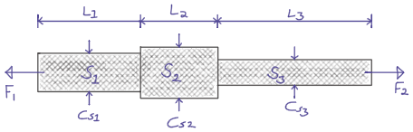
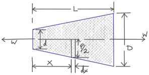

<table>
<tbody>
<tr class="odd">
<td></td>
<td>Subscribe to SiliconWit.com</td>
</tr>
</tbody>
</table>

Mechanics of solids may also go by the names mechanics of materials or
strength of materials.

Simple Stress and Strain
========================

This section covers idealized simple stress and strain. In more complex
cases, some of these simplifications may not apply.

Loading
-------

Components of engineering structures or mechanisms experience various
forces. For example, the cylindrical bar below is used in a lifting
mechanism and so it is subjected to **tension** force along the axis.

A member of a mechanism may experience loading in one of the following
ways.

\(a\) Static, dead, or non-fluctuating loads e.g. force due to gravity  
(b) Live loads e.g. train on the railway  
(c) Impact or shock loads e.g. hammering  
(d) Fatigue, fluctuating, or altering loads e.g. repeated loaded swivel,
crack propagation

Direct or Normal Stress (*σ*)
-----------------------------

This is when a uniform-structured member or a bar is subjected to
***uniform** tension or compression*.

$$\\sigma\\ (\\text{stress}) = \\frac{F\\ (\\text{load})}{A\\ (\\text{area})}\\ \\frac{N}{m^2}$$

Direct or Normal Strain (*ϵ*)
-----------------------------

This is a dimensionless measure of a change in length of a member, after
it has been subjected to tension or compression.

$$\\epsilon\\ (\\text{strain}) = \\frac{\\Delta L\\ (\\text{change in length})}{L\\ (\\text{original length})}$$

Strain may be expressed as a percentage,
$\\epsilon = \\frac{\\Delta L}{L} \\times 100 \\%$. Tensile stress and
strain are considered positive, while compressive ones are considered
negative.

Elastic Materials (Hooke’s Law, *F* = *k**e*)
---------------------------------------------

A member is said to be elastic or obey Hooke’s law if it returns to its
original length when the load is withdrawn. In this case, the stress is
proportional to strain.

$$\\frac{\\sigma}{\\epsilon} = constant$$

Common classification of materials:

Homogeneous material — uniform structure without any flaws or
discontinuities e.g. steel  
Inhomogeneous material — the structure varies from point to point e.g.
concrete, some cast iron  
Isotropic — uniform properties throughout in all directions  
Anisotropic — varying properties  
Othotropic — different properties in different planes e.g. wood, some
composites

Here, we assume homogeneous materials with isotropic properties.

Modulus of Elasticity (Young’s Modulus, *E*)
--------------------------------------------

The constant derived above, within which Hooke’s law applies, is
referred to as the *modulus of elasticity* or the *Young’s modulus*,
**E**.

$$\\frac{\\sigma}{\\epsilon} = E$$

$E = \\frac{F}{A}/ \\frac{\\Delta L}{L} = \\frac{FL}{A \\Delta L}$

The modulus of elasticity is assumed to be the same, both in tension or
in compression. Since its value is large for most engineering materials,
  × 109*N*/*m*2, the strain will be small,  0.3%.
Usually, the deformations are typically small with respect to the
original dimension.

Tensile Test
------------

The modulus of elasticity is determined by carrying out a standard test
as shown in the figure below. In this test, a circular bar of a uniform
cross-section is subjected to a gradually increasing tensile load until
failure occurs. The *change in the **gauge length*** is recorded as the
loading operation continues.

<figure>
<figcaption aria-hidden="true">Tensile test.</figcaption>
</figure>

*Origin to point **A**:* *Hooke’s law* is obeyed. Stress is proportional
to strain.  
*At point **A**:* *limit of proportionality*  
*Between points **A** and **B**:* the material may still be elastic but
Hooke’s law is not obeyed.  
*At point **B**:* *elastic limit*  
In most practical cases, points **A** and **B** are coincident.  
*Beyond point **B**:* *plastic deformation*  
Strains are not totally recoverable and permanent deformations are
recorded when load is removed.  
*At point **C**:* *upper yield point*  
*At point **D**:* *lower yield point*  
A rapid increase in strain occurs without a corresponding increase in
stress.  
*Between points **E** and **F**:* *necking* occurs  
The stress reaches the maximum value, the *ultimate tensile strength*.  
*At point **F**:* the specimen breaks

-   The **ductility** is the capacity of a material to allow large
    plastic deformations.

-   For some materials, say, non-ferrous and high-carbon steel, the
    difference between points C and D cannot be detected. In such cases,
    a **proof stress** is used to show the onset of plastic strain.

Poisson’s Ratio (*v*)
---------------------

When a bar is subjected to a tension load, it experiences an increase in
length, *Δ**L*, giving a longitudinal strain in the bar,
*ϵ**L**o**n**g*.

$\\epsilon\_{Long} = \\frac{\\Delta L}{L}$

The breath, *b*, and the depth, *d*, of the bar will also reduce,
thereby altering the lateral dimensions of the bar. The lateral strain,
*ϵ**L**a**t*, can be given by the following equation.

$\\epsilon\_{Lat} = - \\frac{\\Delta b}{b} = - \\frac{\\Delta d}{d}$

$$v\\ (\\text{Poisson's ratio}) = \\frac{\\epsilon\_{Lat}}{\\epsilon\_{Long}} = - \\frac{\\Delta d}{d} \\times \\frac{L}{\\Delta L}$$

$\\epsilon\_{Long} = \\frac{\\sigma\_{Long}}{E} = \\frac{\\sigma}{E}$

$$\\epsilon\_{Lat} = v \\times \\frac{\\sigma}{E}$$

Modulus of Rigidity (*G*)
-------------------------

### Shear Stress (*τ*)

$$\\tau\\ (\\text{shear stress}) = \\frac{F\\ (\\text{shear load})}{A\\ (\\text{area resisting shear})}$$

$$\\tau\\ (\\text{in double shear stress}) = \\frac{F}{2 \\times A }$$

### Shear Strain (*γ*)

$$\\gamma = \\frac{\\Delta L}{L}$$

-   The **modulus of rigidity**, *G*, or **shear modulus** is comparable
    to modulus of elasticity and it is calculated as follows.

$$G = \\frac{\\tau}{\\gamma} = \\text{constant}$$

-   Before attempting a question, make sure you understand the
    fundamental concept. Draw sketches where necessary. Make sure you
    *derive your equations* correctly, then substitute the values. This
    is useful in preparing a general algorithm and reducing
    approximation errors.

-   Your answers should be in SI units and scientific notation. Use the
    following form **p*.*q**r**s* × 10*t* `units`*. Where
    *p*, *q*, *r*, *s* is a number between 0 − 9, *t* is a signed
    integer, and `units` is the relevant SI units. This is useful in
    establishing a quick objective meaning of size/scale.

 A bar with various cross-sections
--------------------------------------------------------------------------------

A sectional bar of *E* = 210 *G**N*/*m*2 is subjected to an
axial tensile load of *F*1 = *F*2 = 25 *k**N*. The
circular section *C**s*1 has a diameter of 25 *m**m*. A
square cross-section of dimension *C**s*2 = 40 *m**m*, and
circular section *C**s*3 = 20 *m**m* in diameter.
*L*1 = 200 *m**m*, *L*2 = 110 *m**m*,
*L*3 = 450 *m**m*

What is **the stress** in each section and **the total extension** of
the sectional bar?

<figure>
<figcaption aria-hidden="true">Sectional bar.</figcaption>
</figure>

<table>
<colgroup>
<col style="width: 100%" />
</colgroup>
<tbody>
<tr class="odd">
<td style="text-align: left;">
 <em>stress in each section</em> 
$\sigma = \frac{F}{A}$ 
$\sigma_{s1} = \frac{F}{\pi \times \big( \frac{D_1}{2} \big)^2}$

$\sigma_{s2} = \frac{F}{L_2^2}$

$\sigma_{s3} = \frac{F}{\pi \times \big( \frac{D_3}{2} \big)^2}$

 <em>total extension (<em>Δ</em><em>L</em>)</em> 
$\epsilon = \frac{\sigma}{E}$ 
$\epsilon = \frac{\Delta L}{L}$ 
<em>Δ</em><em>L</em> = <em>Δ</em><em>L</em><em>s</em>1 + <em>Δ</em><em>L</em><em>s</em>2 + <em>Δ</em><em>L</em><em>s</em>3 
$\Delta L = \frac{ \sigma_{s1} L_1 + \sigma_{s2} L_2 + \sigma_{s3} L_3}{E}$
</td>
</tr>
</tbody>
</table>

 A bored circular cross-section
-----------------------------------------------------------------------------

-   A 30 *m**m* diameter bar is subjected to an axial tensile load of
    115 *k**N*. Under the action of this load a 200 *m**m* gauge length
    is found to extend 0.15 × 10 − 3 *m**m*. Determine the
    modulus of elasticity for the bar material.

-   To reduce weight whilst keeping the external diameter constant, the
    bar is bored axially to produce a cylinder of uniform thickness,
    what is the maximum diameter of bore possible given that the maximum
    allowable stress is 245 *M**N*/*m*2? The load can be
    assumed to remain constant at 115 *k**N*.

-   What will be the change in the outside diameter of the bar under the
    limiting stress quoted above? (*E* = 210 *G**N*/*m*2 and
    *v*= 0.3)

<table>
<colgroup>
<col style="width: 100%" />
</colgroup>
<tbody>
<tr class="odd">
<td style="text-align: left;">
 <em>modulus of elasticity</em> 
$\frac{\sigma}{\epsilon} = E$ 
$\epsilon = \frac{\Delta L}{L}$ 
$E = \sigma \frac{L}{\Delta L}$ 
$E = \frac{F}{A} \times \frac{L}{\Delta L}$ 
$E = \frac{F}{\pi \times \big(\frac{D}{2}\big)^2} \times \frac{L}{\Delta L}$

 <em>maximum diameter of bore</em> 
$\sigma = \frac{F}{A}$ 
$A = \pi \times \big( \frac{D}{2} \big)^2 - \pi \times \big( \frac{d}{2} \big)^2$ 
$A = \frac{\pi}{4} \times (D^2 - d^2)$ 
$(D^2 - d^2) = \frac{F}{\sigma} \times \frac{4}{\pi}$ 
$d = \sqrt{D^2 - \big( \frac{F}{\sigma} \times \frac{4}{\pi} \big)}$

 <em>change in the outside diameter</em> 
$\epsilon = v \times \frac{\sigma}{E}$ 
$\frac{\Delta d}{d} = v \times \frac{\sigma}{E}$ 
$\Delta d = v \times \frac{\sigma}{E} \times d$
</td>
</tr>
</tbody>
</table>

 A stressed coupling
------------------------------------------------------------------

The coupling shown below is constructed from steel of a rectangular
cross-section and is designed to transmit a tensile force of 50 *k**N*.
If the bolt is of 14.5 *m**m* diameter calculate:

*F* = *F*1 = *F*2 = 50*k**N*  
*F*3 = *F*4 = 25*k**N*  
*W*1 = 55*m**m*  
*T*1 = *T*2 = *T*3 = 7*m**m*

\(a\) the shear stress in the bolt;  
(b) the direct stress in the plate;  
(c) the direct stress in the forked end of the coupling.

<figure>
<figcaption aria-hidden="true">Coupling plate.</figcaption>
</figure>

<table>
<colgroup>
<col style="width: 100%" />
</colgroup>
<tbody>
<tr class="odd">
<td style="text-align: left;">
 <em>shear stress in the bolt</em> 
$\tau = \frac{F}{A}$ 
$\tau = \frac{F}{2 \times A}$ 
$\tau = \frac{4 \times F}{2 \times \pi D^2}$

 <em>direct stress in the plate</em> 
$\sigma = \frac{F}{A}$

 <em>direct stress in the forked end</em> 
$\sigma = \frac{F}{A}$
</td>
</tr>
</tbody>
</table>

 Extension of tapered bar
-----------------------------------------------------------------------

Derive an expression for the total extension of the tapered bar of the
circular cross-section shown below when it is subjected to an axial
tensile load *W*.

<figure>
<figcaption aria-hidden="true">Tapered bar.</figcaption>
</figure>

<table>
<colgroup>
<col style="width: 100%" />
</colgroup>
<tbody>
<tr class="odd">
<td style="text-align: left;">
 Consider a very small length <em>d</em><em>x</em> with diameter <em>P</em>, experiencing the tensile force of <em>W</em>, and then integrate over the whole length, <em>L</em>.

$\Delta L = \frac{\sigma}{E} \times L$ 
$\Delta L = \frac{\sigma}{E} \times dx$ 
$\Delta L = \frac{W}{AE} \times dx$ 
$\Delta L = \frac{W}{\frac{\pi}{4} \times P^2 \times E} \times dx$

<figure>
<figcaption aria-hidden="true">Tapered bar section.</figcaption>
</figure>

<em>P</em> = (2<em>q</em>) + <em>d</em> 
$\frac{q}{x} = \frac{D-d}{2}/L$ 
$q = \frac{(D-d)}{2L} \times x$ 
$P = \frac{(D-d)}{L} x + d$ 
Letting $k = \frac{(D-d)}{L}$, <em>P</em> = <em>d</em> + <em>k</em><em>x</em> 
$\Delta L = \frac{W}{\frac{\pi}{4} \times (d + kx)^2 \times E} dx$ 
$\Delta L = \int_{0}^{L} \frac{4W}{\pi \times (d + kx)^2 \times E} \,dx$ 
$\Delta L = \frac{4W}{\pi E} \int_{0}^{L} (d + kx)^{-2} \,dx$ 
Let <em>u</em> = <em>d</em> + <em>k</em><em>x</em>; $\frac{du}{dx} = k$; $dx = \frac{du}{k}$ 
$\Delta L = \frac{4W}{k \pi E} \int_{0}^{L} (u)^{-2} \,du$ 
$\Delta L = \frac{4W}{k \pi E} \begin{bmatrix}
-(u)^{-1}
\end{bmatrix} _{0}^{L}$ 
$\Delta L = \frac{4W}{k \pi E} \begin{bmatrix}
-(d + kx)^{-1}
\end{bmatrix} _{0}^{L}$ 
$\Delta L = \frac{4W}{k \pi E} \biggr( (\frac{-1}{d + kL}) - (\frac{-1}{d})\biggr)$ 
$\Delta L = \frac{4W}{k \pi E} \biggr( \frac{1}{d} - \frac{1}{d + kL} \biggr)$ 
$\Delta L = \frac{4W}{k \pi E} \biggr( \frac{kL}{d(d + kL)} \biggr)$ 
$\Delta L = \frac{4W}{\pi E} \times \frac{L}{d(d + \Big( \frac{(D-d)}{L} \Big) \times L)}$ 
$\Delta L = \frac{4WL}{\pi E d D}$
</td>
</tr>
</tbody>
</table>

 Error of using mean diameter
---------------------------------------------------------------------------

The mean diameter is used in calculating the modulus of elasticity, *E*,
of a bar tapered from (*D* + *a*) diameter to (*D* − *a*) diameter. Show
that the error involved in calculating *E* is
$\\big( \\frac{10a}{D} \\big)^2 \\%$.

<table>
<colgroup>
<col style="width: 100%" />
</colgroup>
<tbody>
<tr class="odd">
<td style="text-align: left;">
 <em>E</em> for a tapered circular bar should be derived similar to <a href="#circular-taper"> Extension of tapered bar</a> :

$\Delta L = \frac{4WL}{\pi E d D}$ 
$E = \frac{4WL}{\pi \Delta L d D}$ 
$E = \frac{4WL}{\pi \Delta L (D-a) (D+a)}$ 
$E = \frac{4WL}{\pi \Delta L (D^2-a^2)}$ 
But when mean diameter, $D_m = \frac{(D-a)+(D+a)}{2} = D$, is used instead, 
$\Delta L = \frac{WL}{AE_m}$ 
$\Delta L = \frac{WL}{(\frac{\pi}{4}D^2)E_m}$ 
$E_m = \frac{4WL}{\pi \Delta L (D^2)}$ 
$\% error = \frac{E-E_m}{E} \times 100$ 
$\% error = \frac{\big( \frac{4WL}{\pi \Delta L (D^2-a^2)} \big) - \big( \frac{4WL}{\pi \Delta L (D^2)} \big)} {\frac{4WL}{\pi \Delta L (D^2-a^2)}} \times 100$ 
$\% error = \frac{\big( \frac{1}{ (D^2-a^2)} \big) - \big( \frac{1}{D^2} \big)} {\frac{1}{(D^2-a^2)}} \times 100$ 
$\% error = \big( \frac{D^2 - (D^2 - a^2)}{ D^2(D^2-a^2)} \times (D^2-a^2) \big) \times 100$ 
$\% error = \Big( \frac{10 a}{D} \Big)^2 \%$
</td>
</tr>
</tbody>
</table>

 Rectangular tapered bar *ASSIGNMENT*
-----------------------------------------------------------------------------------------------------

A brass plate of uniform thickness 7 *m**m* and length 550 *m**m*,
varies in width from 100 *m**m* to 185 *m**m* and is subjected to a
tension load of 5 *k**N*. Find the elongation of the bar. *E* for brass
 = 82 *G**P**a*.

<table>
<colgroup>
<col style="width: 100%" />
</colgroup>
<tbody>
<tr class="odd">
<td style="text-align: left;">
 Please attempt this assignment.
</td>
</tr>
</tbody>
</table>

 Load-extension graph *ASSIGNMENT*
--------------------------------------------------------------------------------------------------

During a tensile test on a specimen the following results were obtained:

<table>
<colgroup>
<col style="width: 12%" />
<col style="width: 12%" />
<col style="width: 12%" />
<col style="width: 12%" />
<col style="width: 12%" />
<col style="width: 12%" />
<col style="width: 12%" />
<col style="width: 12%" />
</colgroup>
<tbody>
<tr class="odd">
<td style="text-align: left;">
<strong>Load (kN)</strong>
</td>
<td style="text-align: left;">
15
</td>
<td style="text-align: left;">
30
</td>
<td style="text-align: left;">
40
</td>
<td style="text-align: left;">
50
</td>
<td style="text-align: left;">
55
</td>
<td style="text-align: left;">
60
</td>
<td style="text-align: left;">
65
</td>
</tr>
<tr class="even">
<td style="text-align: left;">
<strong>Extension (mm)</strong>
</td>
<td style="text-align: left;">
0.05
</td>
<td style="text-align: left;">
0.094
</td>
<td style="text-align: left;">
0.127
</td>
<td style="text-align: left;">
0.157
</td>
<td style="text-align: left;">
1.778
</td>
<td style="text-align: left;">
2.79
</td>
<td style="text-align: left;">
3.81
</td>
</tr>
<tr class="odd">
<td style="text-align: left;">
<strong>Load (kN)</strong>
</td>
<td style="text-align: left;">
70
</td>
<td style="text-align: left;">
75
</td>
<td style="text-align: left;">
80
</td>
<td style="text-align: left;">
82
</td>
<td style="text-align: left;">
80
</td>
<td style="text-align: left;"></td>
<td style="text-align: left;">
70
</td>
</tr>
<tr class="even">
<td style="text-align: left;">
<strong>Extension (mm)</strong>
</td>
<td style="text-align: left;">
5.08
</td>
<td style="text-align: left;">
7.62
</td>
<td style="text-align: left;">
12.7
</td>
<td style="text-align: left;">
16.0
</td>
<td style="text-align: left;">
19.05
</td>
<td style="text-align: left;"></td>
<td style="text-align: left;">
22.9
</td>
</tr>
</tbody>
</table>

Diameter of gauge length = 19 mm  
Gauge length = 100mm  
Diameter at fracture = 16.49 mm  
Gauge length at fracture = 121 mm

Plot the complete load extension graph and the straight line portion to
an enlarged scale. Hence determine:

\(a\) the modulus of elasticity;  
(b) the percentage elongation;  
(c) the percentage reduction in the area;  
(d) the nominal stress at fracture;  
(e) the actual stress at fracture;  
(f) the tensile strength.

<table>
<colgroup>
<col style="width: 100%" />
</colgroup>
<tbody>
<tr class="odd">
<td style="text-align: left;">
 Please attempt this assignment.
</td>
</tr>
</tbody>
</table>

Compound Bars
=============

-   A compound or composite bar consists of one or more materials bonded
    together rigidly such that the straining action of the external load
    is shared by the materials such that they satisfy **equilibrium
    condition**,
    *F**s* + *F**c* = *F**t**o**t**a**l*.

-   These different materials are constrained to deform together such
    that they satisfy **compatibility condition**,
    *ϵ**m**a**t**e**r**i**a**l*1 = *ϵ**m**a**t**e**r**i**a**l*2.

-   **Modular ratio**, *m*, is given by
    $\\frac{E\_{material1}}{E\_{material2}}$.

*F**s* + *F**c* = *F**t**o**t**a**l*

*ϵ**m**a**t**e**r**i**a**l*1 = *ϵ**m**a**t**e**r**i**a**l*2

 A concrete column with steel reinforcement
-----------------------------------------------------------------------------------------

A reinforced cement concrete column of dimension 625 *m**m* × 625 *m**m*
has eight steel rods of diameter 30 *m**m* as reinforcement. Find the
stresses in steel and concrete, and the elastic shortening of the column
if *E*= 200, 000 *N*/*m**m*2 for steel and
10, 000 *N*/*m**m*2 for concrete. Load on column
= 3000 *k**N* and length = 4 *m*.

<table>
<colgroup>
<col style="width: 100%" />
</colgroup>
<tbody>
<tr class="odd">
<td style="text-align: left;">
 <em>stresses in steel (<em>σ</em><em>s</em>) and concrete (<em>σ</em><em>c</em>)</em> 
 Equilibrium condition: <em>F</em><em>s</em> + <em>F</em><em>c</em> = <em>F</em> 
 Compatibility condition: <em>ϵ</em><em>s</em> = <em>ϵ</em><em>c</em> 
$\frac{\sigma_s}{E_s} = \frac{\sigma_c}{E_c}$ 
$\frac{F_s}{A_sE_s} = \frac{F_c}{A_cE_c}$ 
$F_s = F_c \times \frac{A_sE_s}{A_cE_c}$ 
$F_s = (F - F_s) \times \frac{A_sE_s}{A_cE_c}$ 
$\frac{F_s}{F - F_s} = \frac{A_sE_s}{A_cE_c}$ 
$\frac{1}{\frac{F}{F_s} - 1} = \frac{A_sE_s}{A_cE_c}$ 
$F_s = F \times \frac{A_sE_s}{A_cE_c + A_sE_s}$ 
$\sigma_s = \frac{F_s}{A_s} = \frac{FE_s}{A_cE_c + A_sE_s}$ 
$A_s = 8 \times \pi \big(\frac{D}{2} \big)^2 = 2\pi D^2$ 
<em>A</em><em>c</em> = (<em>d</em><em>i</em><em>m</em><em>e</em><em>n</em><em>s</em><em>i</em><em>o</em><em>n</em> × <em>d</em><em>i</em><em>m</em><em>e</em><em>n</em><em>s</em><em>i</em><em>o</em><em>n</em>) − 2<em>π</em><em>D</em>2 
$\sigma_c = \frac{F_c}{A_c} = \frac{F-Fs}{A_c} = \frac{F-(\sigma_sA_s)}{A_c}$

 <em>elastic shortening (<em>Δ</em><em>L</em>)</em> 
$\epsilon_s = \frac{\Delta L_s}{L_s}$ 
$\epsilon_s = \frac{\sigma_s}{E_s}$ 
$\Delta L_s = L_s \times \frac{\sigma_s}{E_s}$ 
$\Delta L_c = L_c \times \frac{\sigma_c}{E_c}$ 
<em>L</em><em>s</em> = <em>L</em><em>c</em> = <em>L</em> and <em>ϵ</em><em>s</em> = <em>ϵ</em><em>c</em> 
$\Delta L = L \times \frac{\sigma_s}{E_s} = L \times \frac{\sigma_c}{E_c}$ (compression)
</td>
</tr>
</tbody>
</table>

 Encased composite bar
--------------------------------------------------------------------

A steel rod of diameter 65 *m**m* and length 1 *m* is encased by a cast
iron (CI) sleeve 9 *m**m* thick and of internal diameter 65 *m**m*. The
assembly is subjected to a load of 45 *k**N*. Find the stresses in the
two materials and the elongation of the assembly. *E* for steel
= 200 *G**P**a* and *E* for cast iron = 100 *G**P**a*.

<table>
<colgroup>
<col style="width: 100%" />
</colgroup>
<tbody>
<tr class="odd">
<td style="text-align: left;">
 <em>stresses in steel (<em>σ</em><em>s</em>) and cast iron (<em>σ</em><em>I</em>)</em> 
 Equilibrium condition: <em>F</em><em>s</em> + <em>F</em><em>I</em> = <em>F</em> 
 Compatibility condition: <em>ϵ</em><em>s</em> = <em>ϵ</em><em>I</em> 
$\frac{\sigma_s}{E_s} = \frac{\sigma_I}{E_I}$ 
$\frac{F_s}{A_sE_s} = \frac{F_I}{A_IE_I}$ 
$F_s = F_I \times \frac{A_sE_s}{A_IE_I}$ 
$F_s = (F - F_s) \times \frac{A_sE_s}{A_IE_I}$ 
$\frac{F_s}{F - F_s} = \frac{A_sE_s}{A_IE_I}$ 
$\frac{1}{\frac{F}{F_s} - 1} = \frac{A_sE_s}{A_IE_I}$ 
$F_s = F \times \frac{A_sE_s}{A_IE_I + A_sE_s}$ 
$\sigma_s = \frac{F_s}{A_s} = \frac{FE_s}{A_IE_I + A_sE_s}$ 
$A_s = \pi \big(\frac{d}{2} \big)^2$ 
$A_I =  \frac{\pi D^2}{4} + \frac{\pi d^2}{4} = \frac{\pi}{4} (D^2 - d^2)$ 
<em>D</em> = <em>d</em> + (2 × <em>t</em><em>h</em><em>i</em><em>c</em><em>k</em><em>n</em><em>e</em><em>s</em><em>s</em>) 
$\sigma_I = \frac{F_I}{A_I} = \frac{F-Fs}{A_I} = \frac{F-(\sigma_sA_s)}{A_I}$

 <em>elongation of the assembly (<em>Δ</em><em>L</em>)</em> 
$\epsilon_s = \frac{\Delta L_s}{L_s}$ 
$\epsilon_s = \frac{\sigma_s}{E_s}$ 
$\Delta L_s = L_s \times \frac{\sigma_s}{E_s}$ 
$\Delta L_I = L_I \times \frac{\sigma_I}{E_I}$ 
<em>L</em><em>s</em> = <em>L</em><em>I</em> = <em>L</em> and <em>ϵ</em><em>s</em> = <em>ϵ</em><em>I</em> 
$\Delta L = L \times \frac{\sigma_s}{E_s} = L \times \frac{\sigma_I}{E_I}$ (extension)
</td>
</tr>
</tbody>
</table>

 A steel rod and brass bush *ASSIGNMENT*
--------------------------------------------------------------------------------------------------------

A 75 *m**m* diameter compound bar is constructed by shrinking a circular
brass bush onto the outside of a 50 *m**m* diameter solid steel rod. If
the compound bar is then subjected to an axial compressive load of
160 *k**N* determine the load carried by the steel rod and the brass
bush and the compressive stress set up in each material. For steel,
*E* = 210 *G**N*/*m*2; for brass,
*E* = 100 *G**N*/*m*2.

<table>
<colgroup>
<col style="width: 100%" />
</colgroup>
<tbody>
<tr class="odd">
<td style="text-align: left;">
 Please attempt this assignment.
</td>
</tr>
</tbody>
</table>

 Buttwelded stanchion *ASSIGNMENT*
--------------------------------------------------------------------------------------------------

A stanchion is formed by buttwelding together four plates of steel to
form a square tube of outside cross-section 200 *m**m* × 200 *m**m*. The
constant metal thickness is 10 *m**m*. The inside is then filled with
concrete.

\(a\) Determine the cross-sectional area of the steel and concrete  
(b) If *E* for steel is 200 *G**N*/*m*2 and this value is
twenty times that for the concrete, find when the stanchion carries a
load of 368.8 *k**N*,

\(i\) The stress in the concrete  
(ii) The stress in the steel  
(iii) The amount the stanchion shortens over a length of 2 *m*.

<table>
<colgroup>
<col style="width: 100%" />
</colgroup>
<tbody>
<tr class="odd">
<td style="text-align: left;">
 Please attempt this assignment.
</td>
</tr>
</tbody>
</table>

Thermal Stresses and Strains
============================

-   Whenever there is an increase or decrease in the temperature of a
    bar, it expands or contracts.

-   If the bar is allowed to expand or contract freely, no stresses are
    induced in the bar.

-   If free expansion or contraction of the bar is prevented, **thermal
    stresses** are induced in the bar. The corresponding strain is
    called **thermal strain**.

Consider a bar subjected to an increase in temperature.  
*L* = Original length  
*t* = Temperature increase  
*α* = Coefficient of linear expansion  
The increase in length due to the increase in temperature,

*Δ**L* = *L* × *α* × *t*

If the expansion is prevented,  
*σ* = *ϵ* × *E* = *α**t* × *E*  
If the supports yield by an amount of, say, *Δ*,

*Δ**L* = *L**α**t* − *Δ*

$\\sigma = \\epsilon \\times E = \\big( \\alpha t - \\frac{\\Delta}{L} \\big) \\times E$

<table>
<colgroup>
<col style="width: 33%" />
<col style="width: 33%" />
<col style="width: 33%" />
</colgroup>
<thead>
<tr class="header">
<th style="text-align: left;">S. No.</th>
<th style="text-align: left;">Material</th>
<th style="text-align: left;">Coefficient of linear expansion /<em>o</em><em>C</em>(<em>α</em>)</th>
</tr>
</thead>
<tbody>
<tr class="odd">
<td style="text-align: left;">
1.
</td>
<td style="text-align: left;">
Steel
</td>
<td style="text-align: left;">
11.5 × 10 − 6 <em>t</em><em>o</em> 13 × 10 − 6
</td>
</tr>
<tr class="even">
<td style="text-align: left;">
2.
</td>
<td style="text-align: left;">
Wrought iron, Cast iron
</td>
<td style="text-align: left;">
11 × 10 − 6 <em>t</em><em>o</em> 12 × 10 − 6
</td>
</tr>
<tr class="odd">
<td style="text-align: left;">
3.
</td>
<td style="text-align: left;">
Aluminium
</td>
<td style="text-align: left;">
23 × 10 − 6 <em>t</em><em>o</em> 24 × 10 − 6
</td>
</tr>
<tr class="even">
<td style="text-align: left;">
4.
</td>
<td style="text-align: left;">
Copper, Brass, Bronze
</td>
<td style="text-align: left;">
17 × 10 − 6 <em>t</em><em>o</em> 18 × 10 − 6
</td>
</tr>
</tbody>
</table>

 Stress not to be exceeded
------------------------------------------------------------------------

A brass rod 2.5 *m* long is fixed at both ends. If the thermal stress is
not to exceed 77 *M**P**a*, calculate the temperature through which the
rod should be heated. Take the values of *α* and *E* as
17 × 10 − 6/*K* and 90 *G**P**a* respectively.

<table>
<colgroup>
<col style="width: 100%" />
</colgroup>
<tbody>
<tr class="odd">
<td style="text-align: left;">
<em>σ</em> = <em>ϵ</em> × <em>E</em> = <em>α</em><em>t</em> × <em>E</em> 
$t = \frac{\sigma}{\alpha \times E}$
</td>
</tr>
</tbody>
</table>

 Stress when temperature falls
----------------------------------------------------------------------------

Two parallel walls 6.5 *m* apart are held together by a steel rod
26 *m**m* diameter passing through metal plates and nuts at each end.
The nuts are tightened when the rod is at a temperature of
98*o**C*. Determine the stress in the rod, when the
temperature falls to 60.5*o**C*, if

\(a\) the ends do not yield, and  
(b) the ends yield by 1.5 *m**m*  
Take *E* = 200 *G**P**a* and
*α* = 12 × 10 − 6/*o**C*

<table>
<colgroup>
<col style="width: 100%" />
</colgroup>
<tbody>
<tr class="odd">
<td style="text-align: left;">
(a) <em>σ</em> = <em>α</em><em>t</em> × <em>E</em> 
(b) <em>Δ</em><em>L</em> = <em>L</em><em>α</em><em>t</em> − <em>Δ</em> 
$\sigma = \epsilon \times E = \big( \alpha t - \frac{\Delta}{L} \big) \times E$
</td>
</tr>
</tbody>
</table>

 Thermal stress of a tapered bar
------------------------------------------------------------------------------

A rigidly fixed circular bar 1.5 *m* long uniformly tapers from
124 *m**m* diameter at one end to 95 *m**m* diameter at the other. If
the maximum stress in the bar is not to exceed 108 *M**P**a*, find the
temperature through which it can be heated. Take *E* and *α* for the bar
material as 100 *G**P**a* and 18 × 10 − 6/*K* respectively.

<table>
<colgroup>
<col style="width: 100%" />
</colgroup>
<tbody>
<tr class="odd">
<td style="text-align: left;">
<em>Δ</em><em>L</em> = <em>L</em><em>α</em><em>t</em> 
$\Delta L = \frac{4FL}{\pi E d D}$ 
$L \alpha t = \frac{4FL}{\pi E d D}$ 
$F = \alpha t \times \frac{\pi E d D}{4}$ 
$\sigma = \frac{F}{A}$ 
$\sigma = \frac{F}{(\frac{\pi}{4}D^2)}$ 
$\sigma = \frac{ \alpha t \times \frac{\pi E d D}{4}}{(\frac{\pi}{4}D^2)}$ 
$\sigma = \frac{ \alpha t E \times d}{D}$ 
$t = \frac{\sigma D}{ \alpha E \times d}$
</td>
</tr>
</tbody>
</table>

 Stress, strain, and modulus of elasticity *ASSIGNMENT*
-----------------------------------------------------------------------------------------------------------------------

\(a\) A test piece is cut from a brass bar and subjected to a tensile
test. With a load of 6.4 *k**N* the test piece, of diameter
11.28 *m**m*, extends by 0.04 *m**m* over a gauge length of 50 *m**m*.
Determine:

\(i\) the stress,  
(ii)the strain,  
(iii) the modulus of elasticity.

\(b\) A spacer is turned from the same bar. The spacer has a diameter of
28 *m**m* and a length of 250 *m**m*. both measurements being made at
20 *o**C*.The temperature of the spaceris then increased to
100 *o**C*,the natural expansion being entirely prevented.
Taking the coefficientof linear expansion to be
18 × 10 − 6/*o**C* determine:

\(i\) the stress in the spacer,  
(ii) the compressive load on the spacer.

<table>
<colgroup>
<col style="width: 100%" />
</colgroup>
<tbody>
<tr class="odd">
<td style="text-align: left;">
 Please attempt this assignment.
</td>
</tr>
</tbody>
</table>

 Stress when temperature rises *ASSIGNMENT*
-----------------------------------------------------------------------------------------------------------

A steel rod of cross-sectional area 600 *m**m*2 and a coaxial
copper tube of cross-sectional area 1000 *m**m*2 are firmly
attached at their ends to form a compound bar. Determine the stress in
the steel and the copper when the temperature of the bar is raised by
80 *o**C* and an axial tensile force of 60 *k**N* is applied.

For steel, *E* = 200 *G**N*/*m*2 with
*α* = 11 × 10 − 6/*o**C*  
For copper, *E* = 100 *G**N*/*m*2 with
*α* = 16.5 × 10 − 6/*o**C*.

<table>
<colgroup>
<col style="width: 100%" />
</colgroup>
<tbody>
<tr class="odd">
<td style="text-align: left;">
 Please attempt this assignment.
</td>
</tr>
</tbody>
</table>

Tortion of Circular Shafts
==========================

Torsion is the twisting of an object caused by a moment acting about the
object’s longitudinal axis. **Torque** is the moment that causes the
twisting.

Consider a shaft transmitting power.

<figure>
<figcaption aria-hidden="true">Tortion of a circular shaft.</figcaption>
</figure>

$$\\text{The angel of twist, } \\theta = \\frac{TL}{GJ}$$

Where *T* is the applied torque, *L* is the length of the bar, *G* is
the **shear modulus**, and *J* is the **polar moment of inertia**. The
value of *G* can be obtained using an experiment.

-   The polar moment of inertia describes a cross-section’s resistance
    to torsion due to its shape. The polar moment of inertia for a
    hollow bar shown below can be calculated as follows.

<figure>
<figcaption aria-hidden="true">Polar moment.</figcaption>
</figure>

$$\\text{The polar moment of inertia, } J = \\frac{\\pi}{2} \\big( r\_o^4 - r\_i^4 \\big)$$

For a solid circular bar, $J = \\frac{\\pi}{2} \\big( r^4 \\big)$

 Twisting solid cylinder
----------------------------------------------------------------------

A moment of 1500 *N**m* is acting on a solid cylinder shaft with
diameter 150 *m**m* and length 2 *m*. The shaft is made in steel with
modulus of rigidity 79 *G**P**a*.

\(a\) Calculate the angular deflection of the shaft.  
(b) Assuming the shaft is hollow with an inner diameter of 50 *m**m*,
calculate the angular deflection of the shaft.

<table>
<colgroup>
<col style="width: 100%" />
</colgroup>
<thead>
<tr class="header">
<th style="text-align: left;"></th>
</tr>
</thead>
<tbody>
</tbody>
</table>

References
==========

\[EJ-Hearn\] E.J. Hearn. *Mechanics Of Materials: An Introduction to the
Mechanics of Elastic and Plastic Deformation of Solids and Structural
Materials* Oxford University Press, 2010. ISBN 0080523994, 9780080523996
[books.google](https://www.google.com/books?id=7eKu5Kh0dHcC)

\[RSKhurmi\] RS Khurmi | N Khurmi. *A Textbook of Strength of Materials*
S. Chand Publishing, 2019. ISBN 935283397X, 9789352833979
[books.google](https://www.google.com/books?id=FqEbEAAAQBAJ)

\[RSubramanian\] R. Subramanian. *Strength Of Materials* Elsevier, 1997.
ISBN 0198061102, 9780198061106
[books.google](https://www.google.com/books?id=7lCnSQAACAAJ)

index.php'); ?&gt;
